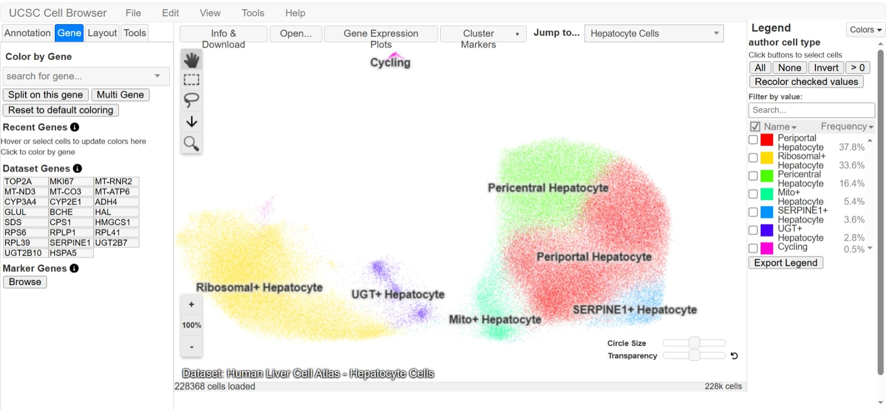
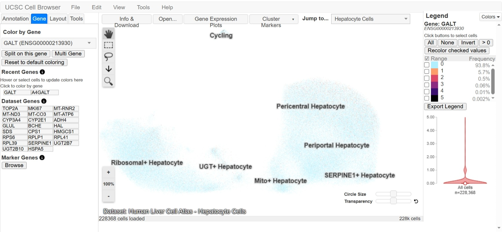
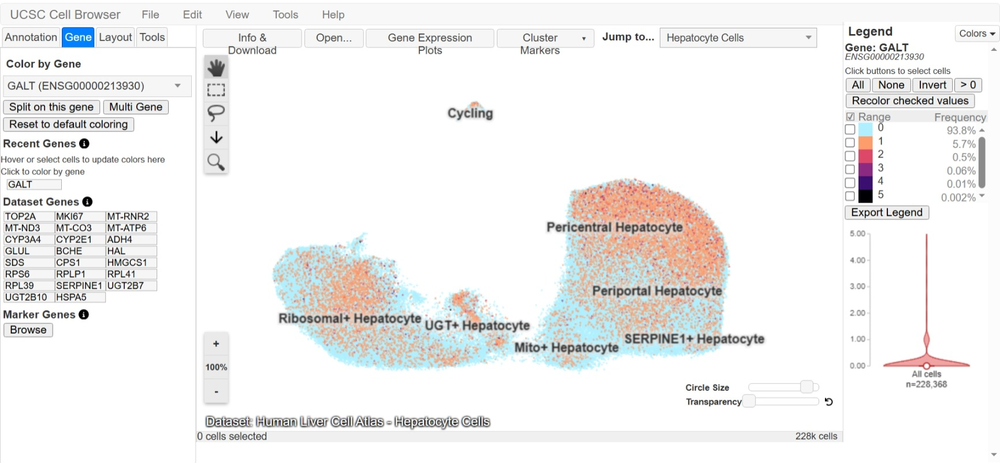
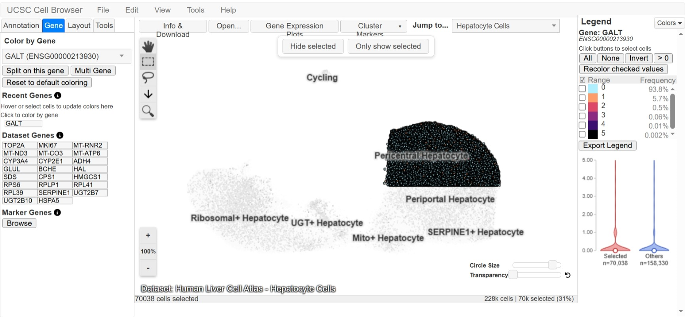
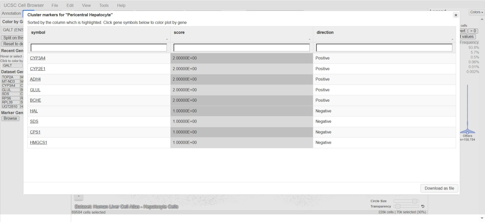
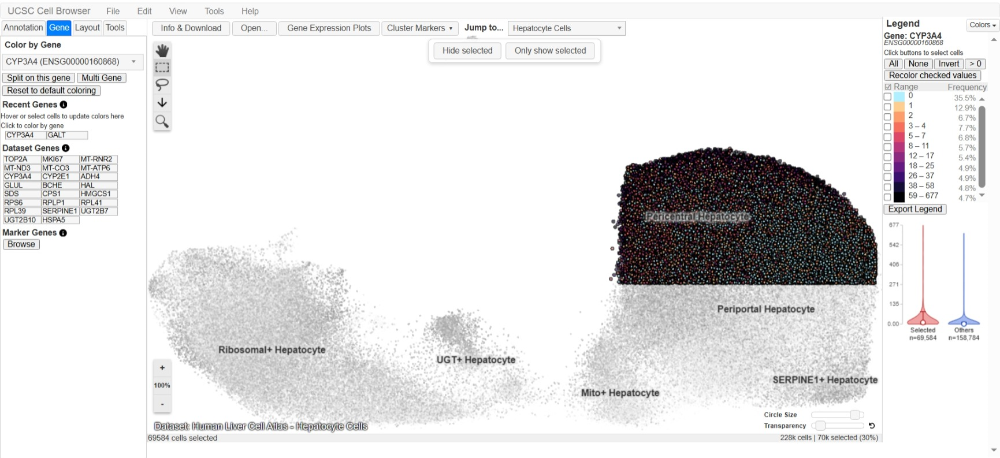

# From Genome to Cell: Exploring GALT Using the UCSC Cell Browser

**Name:** Shahanta Dawn B. Balanza  
**Assigned Gene:** GALT  
**Associated Disease:** Classic Galactosemia  
**Date:** September 25, 2026

## UCSC Cell Browser Activity

This activity investigates the expression of the human **GALT** gene at the single-cell level using the **UCSC Cell Browser**. The activity focuses on exploring a relevant human tissue dataset, examining cell clusters and cell types, visualizing GALT expression, and comparing its expression with marker genes.

## 1. Assigned Gene and Disease

The assigned gene is **GALT (galactose-1-phosphate uridylyltransferase)**, and the associated disease is **Classic Galactosemia**.

The GALT gene is relevant to this activity because pathogenic variants in GALT are associated with classic galactosemia, a disorder affecting the body's ability to properly metabolize galactose.

## 2. Organ/Tissue Choice and Dataset Information

### Relevant Organ/Tissue

The liver was selected because the GALT gene encodes galactose-1-phosphate uridylyltransferase, an enzyme involved in galactose metabolism. Classic galactosemia can significantly affect liver function, making the liver a relevant tissue for examining GALT expression.

### Selected Dataset

**Dataset Name:** Human Liver Cell Atlas - Hepatocyte Cells

**Organ/Tissue:** Human liver

**Organism:** Homo sapiens

**Cell Type:** Hepatocytes

**Number of Cells:** 228,368 cells

**Publication/Study:** Speir et al. (2021)

**Dataset URL:** https://human-liver-cell-atlas.cells.ucsc.edu

### Why This Dataset Was Selected

The Human Liver Cell Atlas - Hepatocyte Cells dataset was selected because the liver is directly relevant to galactose metabolism and the clinical effects of classic galactosemia. The dataset contains human hepatocyte cells, allowing the expression of GALT to be examined across different hepatocyte cell populations.

**Figure 1. Selected Human Liver Cell Atlas dataset.**

## 3. Understanding the Cell Map

### Visualization Type

The dataset is displayed using a **UMAP (Uniform Manifold Approximation and Projection)** visualization. UMAP reduces high-dimensional single-cell expression data into a two-dimensional map so that cells with more similar molecular profiles are generally positioned closer together.

### Meaning of Each Dot

Each dot represents one measured **hepatocyte cell** in the dataset. The dataset contains approximately **228,368 cells**.

### Meaning of the Clusters

The clusters represent different **hepatocyte cell populations or subtypes** identified in the Human Liver Cell Atlas dataset. Cells within the same cluster have similar overall molecular profiles, while the different clusters represent distinct annotated hepatocyte populations.

### Visible Cell-Type/Cluster Labels

At least three visible labels are:

- **Periportal Hepatocyte**
- **Pericentral Hepatocyte**
- **Ribosomal+ Hepatocyte**

Other visible labels include **Mito+ Hepatocyte, UGT+ Hepatocyte, SERPINE1+ Hepatocyte,** and **Cycling**.

### Important Note

The UMAP axes do not represent physical locations in the liver. The positions of cells are based on similarities in their molecular profiles rather than their anatomical positions in the body.

## 4. Assigned Gene Expression

**a. Assigned gene symbol:**  
GALT

**b. Dataset used:**  
Human Liver Cell Atlas - Hepatocyte Cells

**c. Is expression widespread, restricted, or low/undetected?**  
GALT expression is **low or undetected in most cells**. The expression legend shows that 93.8% of cells have an expression value of 0, while 5.7% have a value of 1 and 0.5% have a value of 2.

**d. Which cluster(s) appear to contain cells with stronger expression?**  
Detectable GALT expression is present in several hepatocyte clusters. The **Pericentral Hepatocyte** cluster appears to contain a relatively noticeable number of cells with detectable expression, although the overall expression level remains low.

**e. Which cluster(s) appear to contain little or no detectable expression?**  
Little or no detectable GALT expression is observed in most cells across the **Periportal Hepatocyte, Pericentral Hepatocyte, Ribosomal+ Hepatocyte, Mito+ Hepatocyte, UGT+ Hepatocyte,** and **SERPINE1+ Hepatocyte** clusters.

**Figure 2. GALT expression in the Human Liver Cell Atlas hepatocyte dataset.**

### Interpretation

In this dataset, GALT expression appears to be low or undetected in most measured hepatocytes. This result should be interpreted as the expression pattern observed in this particular single-cell dataset and does not mean that GALT is completely absent from hepatocytes or from liver tissue.

## 5. Cell Types and Clusters

**a. Cell type/cluster with the strongest visible expression:**  
**Pericentral Hepatocyte** shows a relatively noticeable concentration of cells with detectable GALT expression.

**b. Another cell type/cluster with detectable expression:**  
**Periportal Hepatocyte** also contains cells with detectable GALT expression.

**c. Cell type/cluster with relatively low or undetected expression:**  
**UGT+ Hepatocyte** shows relatively little detectable GALT expression compared with the larger hepatocyte populations.

**d. Is the expression pattern broad or cell-type restricted?**  
The expression pattern is **low but broadly distributed across multiple hepatocyte clusters** rather than being strongly restricted to one cell type.

**e. Possible biological explanation:**  
A possible explanation is that different hepatocyte populations can have different metabolic states and gene-expression profiles, which may result in differences in GALT detection. However, this interpretation is based only on the selected Human Liver Cell Atlas dataset, and the high proportion of zero-expression measurements may also reflect limitations of single-cell expression detection.

**Figure 3. GALT expression across labeled hepatocyte cell clusters.**

## 6. Expression Plot

**a. Which cells/cluster did you select?**  
The **Pericentral Hepatocyte** cluster was selected using the rectangular cell-selection tool. A total of **70,038 cells** were selected, representing approximately 31% of the dataset.

**b. Does your selected group show higher, lower, or similar expression compared with the comparison cells?**  
The selected Pericentral Hepatocyte cells show a **similar overall GALT expression distribution** compared with the other cells. Both groups have most expression values concentrated near zero, with a smaller number of cells showing detectable expression.

**c. What does the expression plot add that was not obvious from the UMAP/t-SNE map?**  
The violin plot shows the **distribution of GALT expression values** in the selected cells compared with the other cells. This makes it easier to see that most cells have low or zero expression and to compare the expression distributions between the selected and comparison groups.

### Figure 4. GALT expression comparison between selected Pericentral Hepatocyte cells and other cells.

## 7. Marker Genes

**a. Cluster/Cell Type Examined:**  
Pericentral Hepatocyte

**b. Marker Gene 1:**  
CYP3A4 — Score: 2.0 — Positive

**c. Marker Gene 2:**  
CYP2E1 — Score: 2.0 — Positive

**d. Marker Gene 3:**  
ADH4 — Score: 2.0 — Positive

**e. Does the assigned gene behave like a cell-type marker in this dataset?**  
No. GALT does not appear to behave like a strong cell-type marker in this dataset because its expression was mostly low or undetected across the hepatocyte populations. In contrast, the Pericentral Hepatocyte cluster had specific marker genes such as CYP3A4, CYP2E1, and ADH4 with positive marker scores. This suggests that GALT is not uniquely identifying the Pericentral Hepatocyte cell type in this dataset.

**Screenshot 5:**

**Figure 5. Cluster marker genes for the Pericentral Hepatocyte cluster.**

## 8. Disease Gene vs. Marker Gene

**a. Assigned disease gene:**  
GALT

**b. Marker gene:**  
CYP3A4

**c. Which gene shows a more cell-type-restricted expression pattern?**  
CYP3A4 shows a more cell-type-restricted expression pattern because its stronger expression is concentrated mainly in the **Pericentral Hepatocyte** cluster.

**d. Which gene appears more broadly expressed?**  
GALT appears more broadly distributed across the hepatocyte populations, although its overall expression is low and many cells show undetected expression.

**e. What does this comparison teach you about the difference between a disease-associated gene and a cell-type marker gene?**  
The comparison shows that a disease-associated gene does not necessarily have a cell-type-restricted expression pattern. A cell-type marker such as CYP3A4 can show strong expression in a particular cell population, while a disease-associated gene such as GALT can have a broader or lower expression pattern without uniquely identifying one cell type.

### Comparison Observation

The CYP3A4 map showed strong expression concentrated in the **Pericentral Hepatocyte** cluster, whereas GALT showed mostly low or undetected expression across the hepatocyte populations. This demonstrates the difference between a gene used to characterize a cell type and a disease-associated gene involved in an important biological function.

**Figure 6. CYP3A4 expression across the hepatocyte cell map.**
